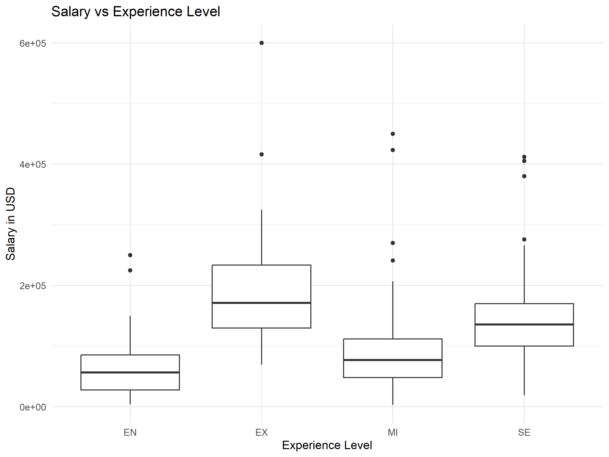
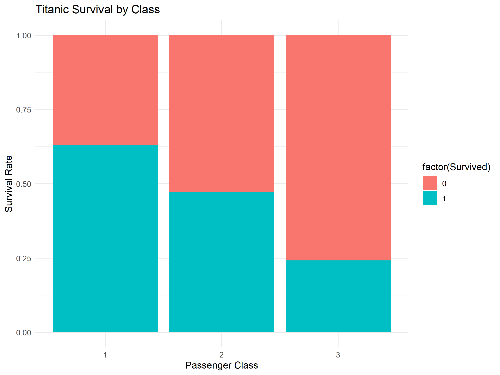
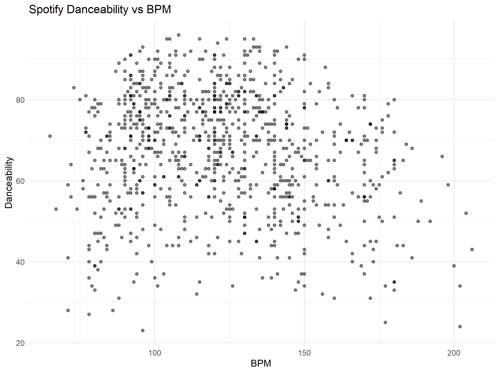

# Multivariate Analysis of Salary, Titanic Survival, and Spotify Popularity

## 📄 Project Overview

This project focuses on the multivariate analysis of three different datasets:

1. **Salary Data Analysis:** Evaluating factors influencing salaries in the data science field.
2. **Titanic Survival Analysis:** Investigating survival rates based on demographic and socio-economic factors.
3. **Spotify Popularity Analysis:** Exploring factors influencing the danceability of popular songs.

### 🔍 Objectives

- Conduct descriptive statistical analysis.
- Perform regression and ANOVA analysis.
- Generate insightful visualizations.
- Validate assumptions and interpret results.

---

## 📂 Project Structure

```
Multivariate-Analysis/
│-- analysis.Rmd              # R Markdown file with the full analysis
│-- data/
│   ├── datascience_salaries.csv # Salary data
│   ├── titanic.csv             # Titanic survival data
│   ├── Popular_Spotify_Songs.csv # Spotify popularity data
│-- images/
│   ├── salary_analysis.png
│   ├── titanic_survival.png
│   ├── spotify_danceability.png
│-- scripts/
│   ├── salary_analysis.R       # R script for salary analysis
│   ├── titanic_analysis.R      # R script for Titanic analysis
│   ├── spotify_analysis.R      # R script for Spotify analysis
│-- README.md                   # Project documentation
```

---

## 📊 Data Analysis Summary

### **1. Salary Data Analysis**

- **Data Source:** Data science job salaries dataset.
- **Key Findings:**
  - Salaries increase with experience level.
  - Job title has a significant impact on salary.
  - No significant interaction between experience level and job title.

**Visualization:**


---

### **2. Titanic Survival Analysis**

- **Data Source:** Historical Titanic passenger data.
- **Key Findings:**
  - Gender and passenger class are significant survival predictors.
  - Older passengers had lower survival rates.
  - The logistic regression model confirms meaningful insights.

**Visualization:**


---

### **3. Spotify Popularity Analysis**

- **Data Source:** Popular Spotify songs dataset.
- **Key Findings:**
  - Danceability is influenced by tempo (BPM) and valence.
  - Additional variables can improve prediction accuracy.
  - Regression analysis highlights significant predictors.

**Visualization:**


---

## 🛠️ Installation & Usage

### 1. Clone the repository
```sh
git clone https://github.com/yourusername/Multivariate-Analysis.git
cd Multivariate-Analysis
```

### 2. Install required dependencies
Ensure you have the necessary R packages installed:
```r
install.packages(c("ggplot2", "gridExtra", "car", "gvlma"))
```

### 3. Run analysis scripts
```r
source("scripts/salary_analysis.R")
source("scripts/titanic_analysis.R")
source("scripts/spotify_analysis.R")
```

---

## 📈 Results Interpretation

- **Salary Analysis:** Identifies significant factors affecting data science salaries.
- **Titanic Analysis:** Confirms key factors influencing survival rates.
- **Spotify Analysis:** Provides insights into song attributes impacting popularity.

---

## 🤝 Contributing

Contributions are welcome! Follow these steps:

1. Fork the repository.
2. Create a feature branch (`git checkout -b feature-branch`).
3. Commit your changes (`git commit -m 'Added new feature'`).
4. Push to the branch (`git push origin feature-branch`).
5. Open a pull request.

---

## 📧 Contact

For questions or suggestions, please contact:
- **Email:** manuelrojasgarcia@gmail.com
- **GitHub:** [yourusername](https://github.com/yourusername)

---

